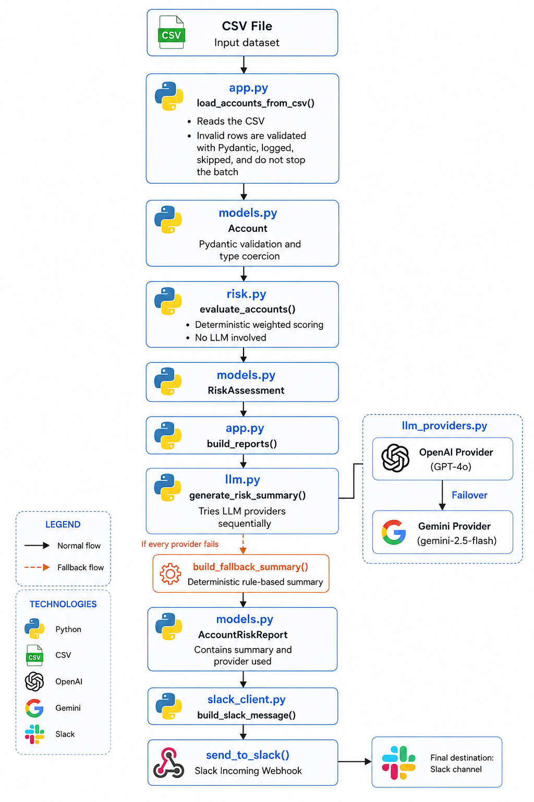

# RevOps Churn Risk Automation

Automates a manual weekly RevOps process: reading an account CSV,
flagging accounts at risk of churn using explainable business rules,
generating a natural-language risk summary for each one with an LLM,
and posting a formatted report to Slack.

**Pipeline:** `CSV → validated accounts → risk scoring → LLM summary (with automatic failover) → Slack report`

---

## Table of contents

- [RevOps Churn Risk Automation](#revops-churn-risk-automation)
  - [Table of contents](#table-of-contents)
  - [Quickstart](#quickstart)
  - [Environment variables](#environment-variables)
    - [Getting a Slack Incoming Webhook](#getting-a-slack-incoming-webhook)
  - [Running it](#running-it)
  - [Architecture](#architecture)
  - [Churn risk logic](#churn-risk-logic)
  - [LLM integration \& multi-provider failover](#llm-integration--multi-provider-failover)
  - [Error handling \& resilience](#error-handling--resilience)
  - [Project Structure](#project-structure)
  - [Stretch goals](#stretch-goals)
    - [✅ Stretch B — Observability (implemented)](#-stretch-b--observability-implemented)
    - [✅ Stretch C — Security (implemented)](#-stretch-c--security-implemented)
    - [❌ Stretch A — Webhook trigger (not implemented, by choice)](#-stretch-a--webhook-trigger-not-implemented-by-choice)
  - [Known limitations \& production improvements](#known-limitations--production-improvements)

---

## Quickstart

```bash
git clone <this-repo>
cd revops-churn-risk-automation

python3.12 -m venv venv
source venv/bin/activate        # Windows: venv\Scripts\activate

pip install -r requirements.txt

cp .env.example .env
# edit .env with your real OPENAI_API_KEY and/or GEMINI_API_KEY, and SLACK_WEBHOOK_URL

python app.py --csv-path sample_accounts.csv --dry-run   # preview, nothing sent to Slack
python app.py --csv-path sample_accounts.csv             # sends the real report to Slack
```

## Environment variables

All configuration lives in `.env` (see `.env.example` for the full template).

| Variable | Required | Description |
|---|---|---|
| `OPENAI_API_KEY` | One of OpenAI/Gemini required | OpenAI API key. |
| `OPENAI_MODEL` | No (default `gpt-4o-mini`) | OpenAI model used for summaries. |
| `GEMINI_API_KEY` | One of OpenAI/Gemini required | Gemini API key ([get one here](https://aistudio.google.com/app/apikey)). |
| `GEMINI_MODEL` | No (default `gemini-2.5-flash`) | Gemini model used for summaries. |
| `SLACK_WEBHOOK_URL` | Yes, unless `--dry-run` | Incoming Webhook URL for the target Slack channel. |
| `RISK_SCORE_THRESHOLD` | No (default `3`) | Minimum score to flag an account as at risk (see [Churn risk logic](#churn-risk-logic)). |

**At least one** of `OPENAI_API_KEY` / `GEMINI_API_KEY` must be set. If
both are set, OpenAI is tried first and Gemini is used as an automatic
failover if OpenAI fails for any reason (quota, outage, timeout). See
[LLM integration](#llm-integration--multi-provider-failover).

### Getting a Slack Incoming Webhook

1. https://api.slack.com/apps → **Create New App** → **From scratch**
2. **Incoming Webhooks** → toggle on → **Add New Webhook to Workspace**
3. Choose the target channel, copy the generated URL into `SLACK_WEBHOOK_URL`

## Running it

```bash
python app.py --csv-path sample_accounts.csv [--dry-run]
```

| Flag | Effect |
|---|---|
| `--csv-path PATH` | Input CSV (default: `sample_accounts.csv`) |
| `--dry-run` | Builds the full Slack payload and prints it to stdout **instead of sending it**. Still calls the real LLM provider(s) — only the Slack delivery step is skipped. Useful for reviewing summaries/formatting without spamming the channel. |

On completion, the CLI logs a run summary, e.g.:

```
INFO Run summary: {'accounts_loaded': 15, 'row_errors': 0, 'accounts_at_risk': 7,
                    'llm_fallbacks_used': 0, 'provider_usage': {'openai': 5, 'gemini': 2},
                    'delivered_to_slack': True}
```

- `row_errors`: CSV rows that failed validation and were skipped (see [Error handling](#error-handling--resilience))
- `llm_fallbacks_used`: accounts where **every** configured LLM provider failed, so a rule-based summary was used instead
- `provider_usage`: how many summaries each provider actually generated — useful for spotting a provider degrading before it fully fails

## Architecture



**Design principle behind this split:** each module has exactly one
reason to change.
- `models.py` — the shape of the data (change it when a field is added/removed)
- `risk.py` — the business rules for what counts as risky (change it when RevOps changes policy)
- `llm_providers.py` — how to talk to a specific LLM vendor's SDK (change it when a vendor's API changes, or a new vendor is added)
- `llm.py` — the prompt and the failover/fallback orchestration (change it when the prompt or the resilience strategy changes)
- `slack_client.py` — message formatting and delivery (change it when the report's look changes)
- `app.py` — wires everything together (change it when the pipeline's steps or CLI change)

**Dependency injection, used consistently.** Every module that talks to
an external service (OpenAI, Gemini, Slack) accepts the client/HTTP
function as a parameter instead of constructing it internally. This is
the same pattern in all three places (`OpenAIProvider`/`GeminiProvider`
in `llm_providers.py`, `send_to_slack`'s `http_post` in
`slack_client.py`, and `run_pipeline`'s `providers` in `app.py`), which
is what made it possible to test the **entire pipeline**, including
multi-provider failover, with zero network calls and zero API cost —
see the fake-provider tests used throughout development.

## Churn risk logic

`risk.py` uses **weighted scoring**, not a single boolean rule. A lone
weak signal is noise; several moderate signals together are a strong
indicator. This also gives RevOps a natural priority order (`HIGH` vs
`MEDIUM`) instead of a flat, unordered list.

| Signal | Condition | Points |
|---|---|---|
| Failed payments (strong) | `failed_payment_count_last_30d >= 2` | +3 |
| Failed payments (weak) | `failed_payment_count_last_30d == 1` | +1 |
| Inactivity (strong) | `days_since_last_login > 30` | +3 |
| Inactivity (weak) | `days_since_last_login > 14` | +1 |
| Support load | `open_support_tickets >= 3` | +2 |
| Subscription status | `status in {past_due, canceled}` | +4 |
| Contract renewal window | `0 <= days_until_contract_end <= 30` | +2 |

**Classification:**
- `score >= 5` → **HIGH**
- `score >= RISK_SCORE_THRESHOLD` (default `3`) → **MEDIUM**
- otherwise → not flagged

MRR deliberately does **not** factor into the score — churn risk is
independent of account size. It's used only for display/prioritization
within the Slack report (larger accounts are easier to spot in the list),
keeping "is this account risky" separate from "how much does it matter
if we lose it."

All signals, thresholds, and the reasoning behind each are in `risk.py`'s
docstrings and inline comments — the code itself is the specification,
written to be explainable to a non-technical RevOps audience.

## LLM integration & multi-provider failover

The prompt design (system prompt, user prompt template, and the full
reasoning behind every wording choice, known failure modes, and
production improvement ideas) is documented in detail in
**[`prompt_design.md`](./prompt_design.md)**.

**Multi-provider failover** (`llm_providers.py` + `llm.py`): the LLM
step tries a list of providers in order — by default OpenAI, then
Gemini, if both are configured — and only falls back to the
deterministic rule-based summary if **every configured provider**
fails for that account. This was added after real testing surfaced a
concrete failure mode (an OpenAI account without billing configured
returns `429 insufficient_quota` on every call); see the "Multi-provider
failover" section of `prompt_design.md` for the full story.

Each provider implements a minimal shared contract
(`llm_providers.LLMProvider`): `name` + `generate(system_prompt, user_prompt, timeout) -> str`.
Adding a third provider (e.g. Anthropic) means writing one new class,
touching no other file except `app.py::_build_providers()`.

## Error handling & resilience

Resilience is applied at **every stage** of the pipeline, each with the
same philosophy: one failure should never take down the batch.

| Failure | Where it's handled | Result |
|---|---|---|
| Malformed CSV row (wrong type, bad enum value, blank field) | `app.py::load_accounts_from_csv` | Row is skipped and logged; the rest of the CSV still loads |
| CSV file doesn't exist / is empty | `app.py::load_accounts_from_csv` | Raises a clear `ConfigError`, not a raw traceback |
| LLM call fails (timeout, quota, network, empty response) | `llm.py::generate_risk_summary` | Tries the next configured provider automatically |
| **Every** LLM provider fails for an account | `app.py::build_reports` | Falls back to a deterministic, signal-based summary; visibly marked in Slack |
| Slack webhook unreachable or returns an error | `slack_client.py::send_to_slack` | Raises `SlackDeliveryError`, logged, process exits non-zero |
| Missing LLM provider configuration | `app.py::main` | Fails fast at startup with a clear message, instead of every account silently hitting the fallback one by one |

A CSV normalization detail worth calling out: `subscription_status`
values from real-world CRM exports (`"Past Due"`, `"Active"`) rarely
match the internal `snake_case` enum exactly. `models.py::Account`
normalizes casing/spacing *before* validating against the enum, while
still rejecting genuinely unknown status values — tolerating known
formatting variance without weakening validation.

## Project Structure

```text
revops-churn-risk-automation/
├── app.py                 # CLI entry point and pipeline orchestration
├── models.py              # Pydantic data models and validation
├── risk.py                # Deterministic churn-risk scoring rules
├── llm.py                 # Prompt orchestration, provider failover, and fallback summaries
├── llm_providers.py       # OpenAI and Gemini provider implementations
├── slack_client.py        # Slack Block Kit formatting and webhook delivery
├── observability.py       # Structured JSON audit logging (Stretch B)
├── sample_accounts.csv    # Sample input dataset
├── prompt_design.md       # Prompt engineering rationale and design decisions
├── requirements.txt       # Python dependencies
├── README.md
└── assets/
    ├── architecture.png   # High-level system architecture
    ├── Slack_2026_07_11.png  
    └── Slack_2026_07_12.png 
```

## Stretch goals

The assessment is explicit that stretch work should not come at the
cost of core quality, and that a well-reasoned scope decision is worth
more than doing everything. Here's what was done, what wasn't, and why.

### ✅ Stretch B — Observability (implemented)

`observability.py::log_account_decision()` emits one structured JSON
record per account, on every run, to a dedicated `audit` logger kept
separate from the human-readable console logs:

```json
{
  "timestamp": "2026-07-12T02:51:17.690520+00:00",
  "account_id": "ACC-1004",
  "account_name": "Sunrise Health",
  "risk_score": 14,
  "risk_level": "high",
  "signals": [
    {"name": "failed_payments", "points": 3},
    {"name": "inactivity", "points": 3},
    {"name": "support_load", "points": 2},
    {"name": "subscription_status", "points": 4},
    {"name": "contract_ending_soon", "points": 2}
  ],
  "summary_source": "gemini",
  "summary_generation_failed": false,
  "summary_length_chars": 148
}
```

**Why this matters specifically for an LLM-based pipeline:** unlike a
purely deterministic system, the LLM step is non-deterministic and not
perfectly reproducible — re-running the same CSV can produce a
differently-worded summary, or route through a different provider if
one is degraded. Without a structured record captured at decision
time, "why was this account flagged, and why did the summary say what
it said, and which provider produced it" becomes unanswerable after
the fact except by re-running the pipeline and hoping for a similar
result. This record separates the **deterministic** part (score,
signals, level — fully reproducible from `risk.py`) from the
**non-deterministic** part (which provider, whether it succeeded,
output length), so a person debugging a bad summary weeks later has
a ground-truth trail instead of a guess. It's also the natural
foundation for two things a production version would need: alerting
when `summary_source` starts trending toward `"fallback"` (a provider
degrading), and building an evaluation dataset from real traffic.

### ✅ Stretch C — Security (implemented)

- **Secrets never touch the codebase.** All credentials come from
  `.env` (gitignored) via `python-dotenv`; `.env.example` ships with
  placeholder values only.
- **The Slack webhook URL is never logged**, including on delivery
  failure — only the HTTP status code and Slack's response body are
  logged, which are non-secret and useful for debugging.
- **All external input (the CSV) is validated, not trusted.**
  `models.py::Account` uses Pydantic to reject malformed rows rather
  than silently coercing them (see [Error handling](#error-handling--resilience)).
- **Log injection hardening.** `account_name` comes from an external
  CSV we don't control the origin of. `models.py` strips non-printable
  characters (newlines, carriage returns) from it, so a maliciously
  crafted account name can't forge fake log lines when interpolated
  into a log message.
- **Prompt injection surface is documented, not hidden.** `account_name`
  is still interpolated directly into the LLM prompt. This is called
  out explicitly as a known risk in `prompt_design.md` rather than
  quietly assumed safe — for an internal RevOps CSV the risk is low,
  but it's the kind of thing that should be re-evaluated the moment
  the CSV's source becomes less trusted.

### ❌ Stretch A — Webhook trigger (not implemented, by choice)

Wrapping `run_pipeline()` in an HTTP endpoint (e.g. FastAPI) would be a
mostly mechanical change — the pipeline function already takes all its
dependencies as parameters and returns a plain dict, specifically so it
*could* be called from something other than a CLI without modification.
Given the explicit instruction to prioritize core quality over stretch
breadth, the time was spent instead on something the core task didn't
ask for but real end-to-end testing surfaced as a genuine production
concern: **automatic failover between two LLM providers** (see
[LLM integration](#llm-integration--multi-provider-failover)), after a
real OpenAI quota error during testing showed that a single-provider
design would mean the whole weekly report degrades to 100% rule-based
summaries the moment one vendor has an outage or billing issue. That
felt like the higher-value use of remaining time than an HTTP wrapper
with no new design decisions behind it.

## Known limitations & production improvements

These are documented rather than fixed, to keep the prototype's scope
honest about what it does and doesn't cover:

- **No automated test suite committed.** Every module was verified
  interactively during development (fake clients/providers, edge
  cases, and a full end-to-end run against real credentials) — see the
  design rationale in each module's docstrings — but there's no
  `pytest` suite in the repo yet. Given the dependency-injection
  pattern used throughout, adding one would mostly mean turning the
  ad-hoc verification scripts used during development into `test_*.py`
  files with `assert` statements; no production code would need to
  change to become testable.
- **Provider order is hardcoded** (OpenAI first, Gemini second) in
  `app.py::_build_providers()`. Making it configurable via an env var
  (e.g. `LLM_PROVIDER_ORDER=gemini,openai`) is a small, low-risk change.
- **Gemini's per-call timeout isn't enforced.** The `google-genai` SDK
  configures timeouts at client construction, not per call like the
  OpenAI SDK — see the caveat in `llm_providers.py::GeminiProvider`.
- **No retry-with-backoff on transient errors.** A failed call moves
  immediately to the next provider rather than retrying the same one.
  Reasonable as a default (fail fast to a healthy provider instead of
  burning time retrying a provider that's out of quota), but a hybrid
  of quick-retry-then-failover would handle purely transient network
  blips more gracefully.
- **One Slack message per run, not chunked.** Slack Block Kit caps
  messages at 50 blocks; with ~7 blocks per flagged account, this
  comfortably supports up to ~30 accounts per run before needing
  pagination into multiple messages.
- **Structured LLM output** (JSON with a `confidence` field) instead of
  free-text prose would make summary quality easier to monitor
  automatically over time — discussed in `prompt_design.md`.
